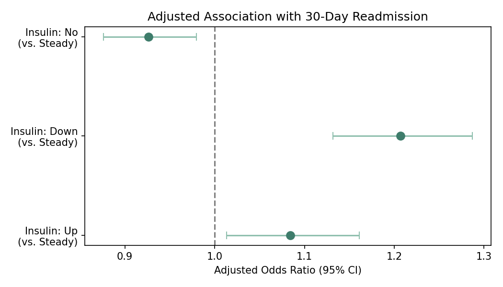

# Insulin Intensification and 30-Day Readmission Risk in Diabetic Inpatients

## What this project does

When a diabetic patient is hospitalized, clinicians sometimes adjust their insulin dose during the stay   starting it, increasing it, or decreasing it. The question this project asks: **does changing a patient's insulin during their hospital stay predict whether they come back within 30 days   and if so, in which direction? **

This is a genuinely different question than "can we predict readmission" (a common project on this dataset). This is about one specific, clinically meaningful decision   insulin adjustment   and whether it's associated with better or worse outcomes once your account for how sick the patient already was.

I used the same real, publicly available dataset of 100,000+ diabetic hospital encounters (UCI, 1999–2008) used in readmission-prediction projects, but ran a different kind of analysis: **interpretable statistical regression with adjusted odds ratios**, not a black-box classifier   because the goal here is to explain an association, not just predict an outcome.

## The core tension this analysis is built around

There's a real confound hiding in this question. If insulin gets intensified mostly in patients who are already harder to manage, then intensification could look "bad" in the data   not because adjusting insulin causes readmission, but because sicker patients get their insulin adjusted *and* are more likely to be readmitted regardless. This is called **confounding by indication**, and it's a classic problem in real-world evidence work. This analysis adjusts for age, number of diagnoses, prior healthcare utilization, length of stay, number of medications, and glycemic severity (A1C) specifically to try to separate the two.

## What I found

**Restricted to the 74,874 encounters where the patient was on diabetes medication: **

**Unadjusted 30-day readmission rate by insulin status: **

! [Unadjusted readmission rate by insulin status](reports/figures/readmission_by_insulin_status.png)

| Insulin status | Readmission rate | N |
|---|---|---|
| No insulin | 10.6% | 23,272 |
| Down (decreased) | 14.3% | 11,737 |
| Steady (no change) | 11.4% | 29,132 |
| Up (increased/started) | 13.5% | 10,733 |

**After adjusting for age, comorbidity burden, prior utilization, length of stay, and A1C severity: **

| Comparison (vs. Steady) | Adjusted Odds Ratio | 95% CI | p-value |
|---|---|---|---|
| Insulin increased ("Up") | **1.08** | 1.01 – 1.16 | 0.020 |
| Insulin decreased ("Down") | **1.21** | 1.13 – 1.29 | <0.001 |
| No insulin | 0.93 | 0.88 – 0.98 | 0.007 |

**The finding that stands out: ** even after adjusting for how sick the patient was, both increasing *and* decreasing insulin during the stay were independently associated with higher 30-day readmission odds compared to patients whose insulin dose stayed steady   with the *decrease* group showing the strongest association (21% higher odds). That's a genuinely counterintuitive pattern worth digging into further: an insulin dose reduction during hospitalization might reflect a patient whose regimen is being pulled back for a reason (e.g., renal function decline, hypoglycemia risk, or discontinuation ahead of a difficult discharge)   itself a marker of instability, not stabilization.

**Secondary check   length of stay: ** insulin changes (in either direction) was associated with meaningfully longer hospital stays (Up: +0.33 days, down: +0.13 days, both p<0.001) even after adjustment   consistent with insulin changes being a marker of a more complicated admission, not a routine one.

## Why these matters for a pharmacy/health economics audience

Insulin management is one of the most common, highest-stakes medication decisions in inpatient diabetes care, and it's exactly the kind of utilization pattern payers and health systems track for both clinical quality and cost purposes. This kind of adjusted-association analysis   not just "can we predict this," but "does this specific, modifiable clinical decision track with the outcome once you control for severity"   is closer to how real pharmacoepidemiology and RWE studies are built and is directly relevant to value-based diabetes care programs trying to figure out which inpatient practices are worth targeting.

## What's in this repo

- **`code/medication_intensification_analysis.py`**   the full analysis: cohort construction, unadjusted rates, adjusted logistic regression (readmission) and OLS regression (length of stay), and both figures
- **`reports/`**   odds ratio table and length-of-stay coefficient table, both as CSV
- **`reports/figures/`**   unadjusted readmission-rate bar chart and adjusted odds-ratio forest plot

## Tools used

Python   pandas, numpy, statsmodels, matplotlib

## About me

Shruthi Nagaraju, MD, MHA (DHA Candidate

## Limitations

This is an observational, retrospective association study   it cannot establish that insulin changes *cause* readmission or protect against it, only that they're statistically associated after adjusting for the confounders measured here. Unmeasured confounding is a real concern: the reason a clinician chose to change insulin (declining renal function, hypoglycemia, discharge planning, non-adherence concerns) is not directly observable in this dataset and likely explains part of this association. The dataset is 1999–2008, and inpatient diabetes management practices have evolved since. A1C was only recorded for a minority of encounters. This analysis is for educational and methodological purposes and should not be used to guide real clinical insulin-management decisions.

